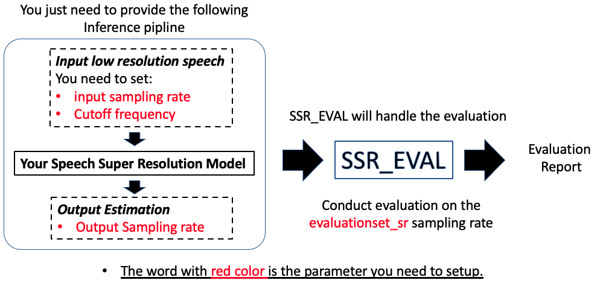

# SSR_EVAL
What this repo do:
- A toolbox for the evaluation of speech super-resolution algorithms.
- Benchmarking speech super-resolution methods (pull request is welcome!). Encouraging reproducible research.



## Installation  
Install via pip:
```shell
pip3 install ssr_eval
```
Please make sure you have already installed [sox](http://sox.sourceforge.net/sox.html).

## Quick Example
```python
# examples/test2.py:
from ssr_eval import SSR_Eval_Helper, BasicTestee

# You need to implement a class for the model to be evaluated.
class MyTestee(BasicTestee):
    def __init__(self) -> None:
        super().__init__()
    

    # You need to implement this function
    def infer(self, x):
        """A testee that do nothing

        Args:
            x (np.array): [sample,], with model_input_sr sample rate
            target (np.array): [sample,], with model_output_sr sample rate

        Returns:
            np.array: [sample,]
        """
        return x
    
testee = MyTestee()
# Initialize a evaluation helper
helper = SSR_Eval_Helper(testee, 
                    test_name="unprocessed", # Test name for storing the result
                    input_sr=44100, # The sampling rate of the input x in the 'infer' function
                    output_sr=44100, # The sampling rate of the output x in the 'infer' function
                    evaluation_sr=48000, # The sampling rate to calculate evaluation metrics. 
                    setting_fft = {
                        "cutoff_freq": [24000], # The cutoff frequency of the input x in the 'infer' function
                    }, 
)
# Perform evaluation
helper.evaluate()
```
The code will automatically handle stuffs like downloading test sets. The evaluation result will be saved in the ./results directory.

## Baselines

We provide several pretrained baselines. For example, to run the NVSR baseline, you can click the link in the following table for more details. 

<hr>

<b>Table.1 Log-spectral distance (LSD) on different input sampling-rate (Evaluated on 44.1kHz).</b>

|  Method | One for all | Params| 2kHz | 4kHz | 8kHz | 12kHz | 16kHz | 24kHz | 32kHz |  AVG |
|:--------------------:|:----:|:----:|:----:|:----:|:----:|:-----:|:-----:|:-----:|:-----:|:----:|
| NVSR [[Pretrained Model](https://github.com/haoheliu/ssr_eval/tree/main/examples/NVSR)] | Yes | 99.0M | 1.04 | 0.98 | 0.91 |  0.85 |  0.79 |  0.70 |  0.60 | 0.84 |
| WSRGlow(24kHz→48kHz) | No | 229.9M | - | - | - |  - |  - |  0.79 |  - | - |
| WSRGlow(12kHz→48kHz) | No | 229.9M | - | - | - |  0.87 |  - |  - |  - | - |
| WSRGlow(8kHz→48kHz) | No | 229.9M | - | - | 0.98 |  - |  - |  - |  - | - |
| WSRGlow(4kHz→48kHz) | No | 229.9M | - | 1.12 | - |  - |  - | - |  - | - |
| Nu-wave(24kHz→48kHz) | No | 3.0M | - | - | - |  - |  - |  1.22 |  - | - |
| Nu-wave(12kHz→48kHz) | No | 3.0M | - | - | - |  1.40 |  - |  - |  - | - |
| Nu-wave(8kHz→48kHz) | No | 3.0M | - | - | 1.42 |  - |  - |  - |  - | - |
| Nu-wave(4kHz→48kHz) | No | 3.0M | - | 1.42 | - |  - |  - |  - |  - | - |
| Unprocessed      | - |  - | 5.69 | 5.50 | 5.15 |  4.85 |  4.54 |  3.84 |  2.95 | 4.65 |

> Click the link of the model for more details.

> Here "one for all" means model can process flexible input sampling rate.

## Features
The following code demonstrate the full options in the SSR_Eval_Helper:

```python
testee = MyTestee()
helper = SSR_Eval_Helper(testee, # Your testsee object with 'infer' function implemented
                        test_name="unprocess",  # The name of this test. Used for saving the log file in the ./results directory
                        test_data_root="./your_path/vctk_test", # The directory to store the test data, which will be automatically downloaded.
                        input_sr=44100, # The sampling rate of the input x in the 'infer' function
                        output_sr=44100, # The sampling rate of the output x in the 'infer' function
                        evaluation_sr=48000, # The sampling rate to calculate evaluation metrics. 
                        save_processed_result=False, # If True, save model output in the dataset directory.
                        # (Recommend/Default) Use fourier method to simulate low-resolution effect
                        setting_fft = {
                            "cutoff_freq": [1000, 2000, 4000, 6000, 8000, 12000, 16000], # The cutoff frequency of the input x in the 'infer' function
                        }, 
                        # Use lowpass filtering to simulate low-resolution effect. All possible combinations will be evaluated. 
                        setting_lowpass_filtering = {
                            "filter":["cheby","butter","bessel","ellip"], # The type of filter 
                            "cutoff_freq": [1000, 2000, 4000, 6000, 8000, 12000, 16000], 
                            "filter_order": [3,6,9] # Filter orders
                        }, 
                        # Use subsampling method to simulate low-resolution effect
                        setting_subsampling = {
                            "cutoff_freq": [1000, 2000, 4000, 6000, 8000, 12000, 16000],
                        }, 
                        # Use mp3 compression method to simulate low-resolution effect
                        setting_mp3_compression = {
                            "low_kbps": [32, 48, 64, 96, 128],
                        },
)

helper.evaluate(limit_test_nums=10, # For each speaker, only evaluate on 10 utterances.
                limit_speaker=-1 # Evaluate on all the speakers. 
                )
```

## Dataset Details
The evaluation set is the VCTK Multi-Speaker benchmark.

